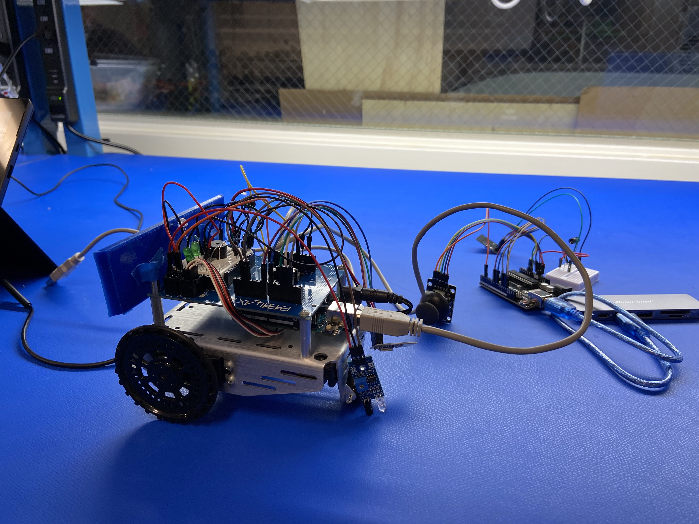
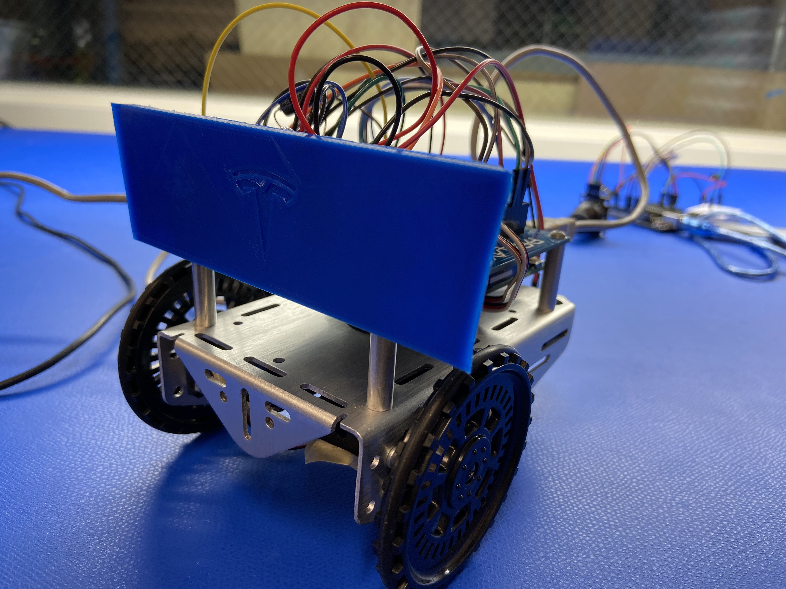
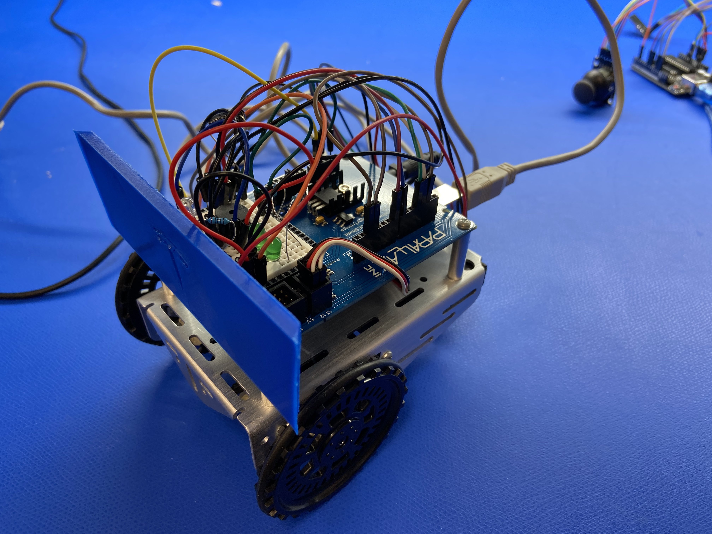

# Xplora
A remote-controlled car designed for exploring unknown and risky environments. Group research project for the 2022 Winter Scholars Program at Skyline College.

## Sources Utilized

1. Bluetooth 
   1. https://howtomechatronics.com/tutorials/arduino/arduino-wireless-communication-nrf24l01-tutorial/
2. Joystick 
   1. https://components101.com/modules/joystick-module
3. Parallax Shield Bot Manual (for infrared sensor, light sensor, piezo buzzer, movement)
   1. https://www.parallax.com/package/brobotics-with-the-board-of-education-shield-for-arduino/

## Presentation Slides
https://docs.google.com/presentation/d/1GXjmx-cizyWXwN5bkxnA40AgGVpAdgFClJAhOuskXjQ/edit?usp=sharing